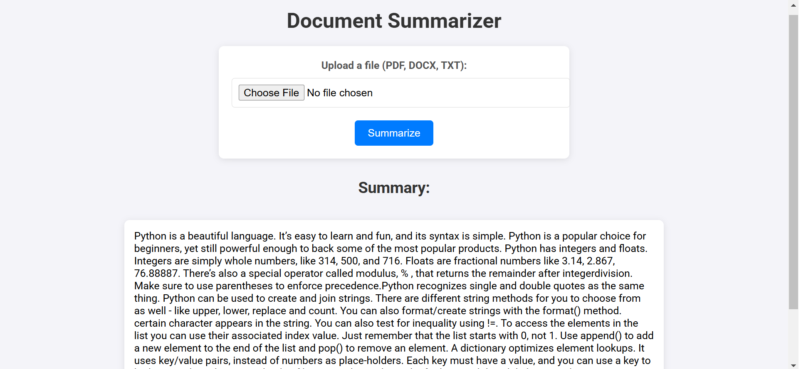

# Document Summarizer

## 📄 Project Overview

The **Document Summarizer** is a web application that allows users to upload PDF, Word (DOCX), and TXT files and receive a summarized version of the document. The app uses **Hugging Face transformers** and **PyTorch** to perform text summarization.

## ✨ Features

- Upload a file (PDF, DOCX, TXT).
- View the summarized text on the same page.
- Clean and modern user interface.
- Supports large documents.

## 🛠️ Technologies Used

- **Flask** – Web framework for building the application.
- **PyMuPDF (fitz)** – For extracting text from PDF files.
- **python-docx** – For extracting text from Word documents.
- **Transformers (Hugging Face)** – For text summarization.
- **PyTorch** – For running the summarization models.
- **HTML/CSS** – For creating the user interface.

## 🚀 How to Run the Project

### 1. Clone the Repository

```bash
git clone https://github.com/plavsic-marko/document-summarizer.git
cd document-summarizer
```

### 2. Create a Virtual Environment

```bash
python -m venv venv
```

### 3. Activate the Virtual Environment

- **Windows:**
  ```bash
  venv\Scripts\activate
  ```
- **Linux/Mac:**
  ```bash
  source venv/bin/activate
  ```

### 4. Install Dependencies

```bash
pip install -r requirements.txt
```

### 5. Run the Application

```bash
python main.py
```

### 6. Open the App in Your Browser

Go to **[http://127.0.0.1:5000](http://127.0.0.1:5000)** in your web browser.

## 📚 Model Used

The application uses the **`facebook/bart-large-cnn`** model from Hugging Face for text summarization. This model is optimized for generating concise summaries of large texts.

## 🎨 User Interface

The application features a clean and modern user interface with:

- A form to upload PDF, DOCX, or TXT files.
- A section to display the summarized text.

### 💻 Screenshot



## 🧑‍💻 Contribution Guidelines

1. Fork the repository.
2. Create a new branch for your feature or bug fix.
3. Commit your changes.
4. Submit a pull request.

## 📄 License

This project is licensed under the **MIT License**.

## 💬 Contact

For any questions or feedback, please reach out to ** Email: plavsicmarko10@gmail.com GitHub: https://github.com/plavsic-marko**.
